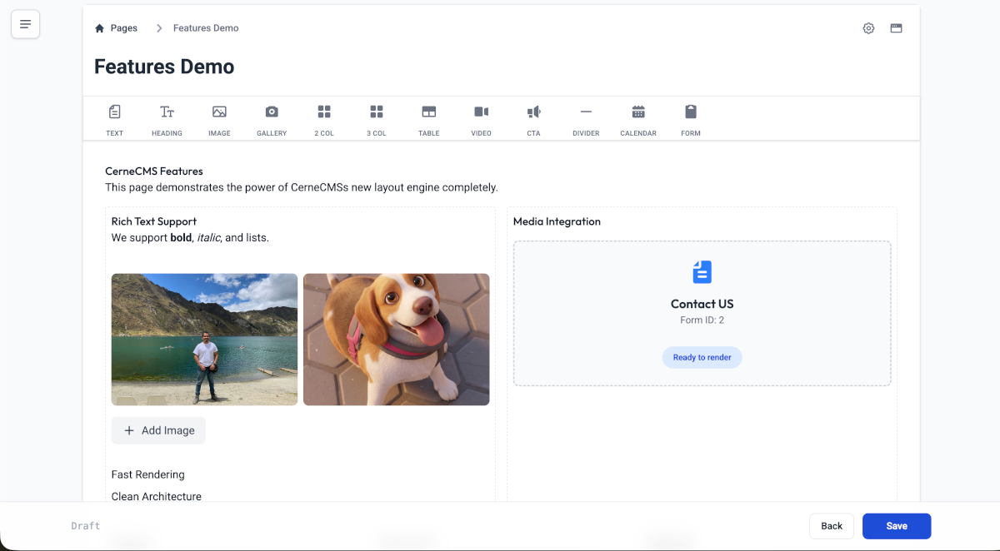

# CerneCMS


**CerneCMS** is a lightweight, modern, block-based Content Management System (CMS) designed for small websites. Perfect for landing pages, product pages, portfolios, and other simple web projects that need an intuitive content management experience.

## 🎯 For End Users

**CerneCMS is distributed as a ready-to-use deployable bundle** - simply download the zip file, extract it to your PHP hosting, and you're ready to go!

### What You Need
- **Standard PHP hosting** (PHP 8.2 or higher)
- **No technical knowledge required** - no Composer, no Node.js, no build tools
- **Just upload and use** - everything is pre-built and ready

### Perfect For
- 🏠 **Landing Pages** - Create stunning single-page websites
- 🛍️ **Product Pages** - Showcase your products with rich content
- 📄 **Portfolios** - Display your work professionally
- 📢 **Marketing Sites** - Simple, effective web presence
- 🎨 **Small Business Sites** - Get online quickly without complexity

### Key Benefits
- **Zero Setup** - No installation wizard, no configuration needed
- **Intuitive Editor** - Drag-and-drop blocks to build pages visually
- **Instant Deployment** - Upload to any standard PHP host
- **No Dependencies** - Everything included in the bundle
- **Lightweight** - Fast, efficient, and easy to maintain

---

## 🛠️ For Developers

**CerneCMS** bridges the gap between a headless-ready architecture and a traditional PHP-based rendering engine. Built with **FlightPHP** for the backend and **Svelte 5 + Tiptap** for a rich, drag-and-drop editing experience.



## 🚀 Key Features

### Data & Content
*   **Block-Based Editor**: Powered by Tiptap, supporting:
    *   **Advanced Layouts**: 2 and 3-column customizable grids.
    *   **Drag & Drop**: Reorder blocks and widgets intuitively.
    *   **Rich Widgets**: Tables, YouTube Video (with specific UI), Dividers, Images.
*   **JSON-First**: Content is stored as structured JSON, making it API-ready for headless consumers.
*   **SQLite Database**: Zero-configuration, file-based database (located in `content/database`).

### Admin Experience
*   **Modern UI**: Built with Svelte 5, TailwindCSS, and Flowbite.
*   **Media Manager**: Integrated upload and gallery management.
*   **Responsive**: Fully responsive admin interface.

### Theming & Development
*   **Theme Engine**: Render content using **Latte** templates.
*   **Blade-like Syntax**: Clean, separate view logic in `content/themes/default`.
*   **Vite Integration**: Modern frontend tooling for Svelte builds.

## 🛠️ Technology Stack

*   **Backend**: PHP 8.2+, FlightPHP (micro-framework).
*   **Frontend**: Svelte 5, Vite, TailwindCSS 4.
*   **Editor**: Tiptap Headless Wrapper.
*   **Database**: SQLite 3.
*   **Templating**: Latte.

## 📦 Installation

### For End Users (Recommended)
Simply download the pre-built CerneCMS bundle (zip file), extract it to your PHP hosting directory, and access your site. No installation steps required!

### For Developers (Building from Source)

**Note:** These instructions are for developers who want to build CerneCMS from source. End users should use the pre-built bundle.

#### Prerequisites
*   PHP 8.2 or higher
*   Composer
*   Node.js (LTS) & pnpm (or npm)

#### 1. Setup Backend
```bash
composer install
```
This will install FlightPHP, Latte, and other PHP dependencies.

#### 2. Setup Frontend
```bash
pnpm install
pnpm run build
```
This builds the Svelte admin interface and outputs assets to `public/assets`.

#### 3. Initialize & Run
The database is auto-initialized on the first run if it doesn't exist.

Start the PHP built-in server:
```bash
php -S 127.0.0.1:8080 -t public
```

**Access Points:**
- **Admin Panel**: http://127.0.0.1:8080/admin
- **Frontend Site**: http://127.0.0.1:8080/

#### 4. Frontend Development (Optional)
For hot-reload during frontend development:
```bash
npm run dev      # Starts Vite on port 5173+
npm run build    # Rebuild for production (required for port 8080)
```

## 📂 Project Structure

```
├── app/                  # Core Application Logic
│   ├── config/           # Setup & Routes
│   ├── controllers/      # Nav, API, Admin logic
│   ├── models/           # ActiveRecord Models (Post, Page)
│   ├── services/         # BlockRenderer, MediaService
│   └── views/            # Backend Admin Views (Latte)
├── content/              # User Data
│   ├── database/         # SQLite file (cms.sqlite)
│   ├── media/            # Uploaded files
│   └── themes/           # Frontend Themes (default/)
├── public/               # Web Root (index.php, assets/)
├── src/                  # Svelte Frontend Source
│   ├── lib/              # Components, Stores, Extensions
│   ├── App.svelte        # Main Admin App
│   └── main.js           # Entry Point
└── vendor/               # PHP Dependencies
```

## 🔌 Extensibility

### Adding New Blocks
1.  **Backend**: Update `app/services/BlockRenderer.php` to handle the new JSON node type.
2.  **Frontend**:
    *   Add node extension to `src/lib/stores/editor.svelte.js`.
    *   Add UI button to `src/lib/components/ComponentToolbar.svelte`.

### Theming
Themes are located in `content/themes/`. The default theme uses `layout.latte` for the shell and `page.latte` for individual page rendering.
